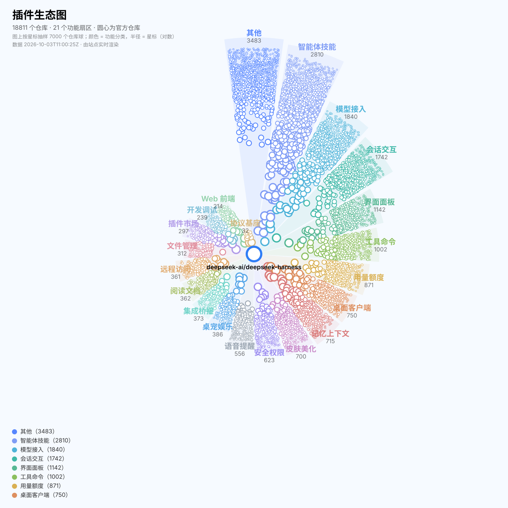

# 插件生态图 · Plugin Ecosystem Map

**把带 `dsh` 系列 GitHub 标签的仓库，画成一张可交互的生态网络图。**

[](http://104.129.51.126/)
[](#测试)
[](#技术选型)
[](#)

👉 **在线地址：<http://104.129.51.126/>**

<picture>
  <source media="(prefers-color-scheme: dark)" srcset="docs/preview.svg">
  <source media="(prefers-color-scheme: light)" srcset="docs/preview-light.svg">
  
</picture>

> 上图由 `node tools/snapshot-svg.mjs` 从真实数据生成 —— 复用前端的布局与配色代码，
> 所以它永远和当前代码一致，不会出现「README 里的图还是三个版本前」的情况。

---

## 这是什么

自动捕获带以下标签的 GitHub 仓库：

`dsh` · `dsh-desktop` · `dsh-plugin` · `dsh-plugin-desktop` · `dsh-plugin-market` · `dsh-plugins`

然后**按功能**（不是按标签）把它们铺成一张生态图：

- **圆心**固定为官方仓库 `deepseek-ai/deepseek-harness`
- **19 个功能扇区**：智能体技能、模型接入、桌面客户端、界面面板、皮肤美化、插件市场、会话交互、记忆上下文、语音提醒、工具命令、开发调试、Web 前端、用量额度、安全权限、远程访问、集成桥接、文件管理、阅读文档、桌宠娱乐
- **细枝分类**：每个扇区下再分 2~5 个细枝（共 61 条规则）
- **单扇区放大**：点任一扇区，该扇区铺满整圆，圆内按细枝重新分扇区

> 这不是 DSH 插件，不依赖 DSH 运行时；它是一个独立的静态前端 + Python 采集后端。

## 功能

| 能力 | 说明 |
|---|---|
| 扇区布局 | 按功能分区、同心散布；位置由可播种 PRNG 决定，**同一 seed 逐点可复现** |
| 单扇区放大 | 点扇区 → 大扇区当整圆、细枝当扇区；`Esc` 或「← 返回全局」退回 |
| 三类连线 | 同作者（默认开）、同扇区近邻、主题共现；度数上限只裁主题边，owner 边豁免（否则同作者会「断线」） |
| 筛选 | 标签「与」语义、语言、归档状态、关键词搜索；筛选只淡化不移除，位置保持不变 |
| 头像 | 并发 6、按 URL 去重、球太小不发请求；默认开 |
| 手机端 | ≤900px 画布全屏、侧栏变底部抽屉且**左右互斥**、双指缩放、安全区适配 |
| 访问统计 | 同端口最小 API：访问数 / 同时在线；拿不到接口时整栏隐藏 |
| 缓存 | gzip + ETag/304 + IndexedDB 秒开 + 后台校验 |
| 双主题 | 清爽（蓝白）、粉黛；明暗各一套，画布文字深色白字 / 浅色黑字 |

## 快速开始

**看线上版**：<http://104.129.51.126/>

**本地跑**（零依赖，只要 Node ≥ 20）：

```bash
git clone <repo> && cd dsh-plugin-mesh
npm run serve:lan                        # http://<你的局域网IP>:8788/
npm test                                 # 93 项前端测试
python3 backend/tests/test_collector.py  # 33 项后端测试
```

**采集数据**（需要 GitHub 令牌，见下）：

```bash
cp .env.example .env     # 填入 GITHUB_TOKEN=...
python3 backend/collect.py --once                 # 跑一轮
python3 backend/collect.py --loop --interval 3600 # 常驻，每小时一轮
```

> ⚠️ 用 pm2 托管时必须写 `--loop` 而不是 `--watch`：pm2 会把 `--watch` 认成它自己的文件监听开关，
> 于是采集器每次落盘都被 SIGINT 重启（实测重启 347 次、丢掉 1.5 万个仓库）。

## 需要什么样的 GitHub 令牌

采集器只读**公开仓库**的搜索接口，令牌本身**不需要任何仓库权限** —— 唯一作用是提高配额：

| 项 | 要求 |
|---|---|
| 类型 | **Fine-grained personal access token**（推荐）或 classic token |
| 权限 / scopes | **全都不勾**（公开搜索不需要权限） |
| 仓库访问 | `Public repositories` 即可（fine-grained 下选 "Public Repositories (read-only)"） |
| 有效期 | 建议 90 天，到期换新 |
| 效果 | 搜索接口 **30 次/分**（匿名只有 10 次/分），core 5000 次/时 |

**获取步骤**：GitHub → Settings → Developer settings → Personal access tokens → Fine-grained tokens → Generate new token →
Repository access 选 *Public repositories* → Permissions 全部留空 → 生成后复制 `github_pat_...`。

**放到哪里**：项目根目录的 `.env`（已在 `.gitignore` 里，服务端 403 不可读）：

```
GITHUB_TOKEN=github_pat_xxxxxxxx
```

配置好后用自检脚本确认（**只打印配额数字，不打印令牌**）：

```bash
python3 backend/check_token.py
# 期望：search 上限 30 / 判定: 令牌生效（30 次/分档）
```

## 数据管线

Python 标准库实现，零 pip 依赖、零模型调用：

```
GitHub 搜索 API
   └─ 分段扫描（segments.py）
        ├─ 抓取空间切成「标签 × 星标区间」的段
        ├─ 一段命中数 > 1000（接口上限）就按创建时间细分：年 → 季度 → 月 → 半月 → 日
        ├─ 每轮只刷新最久没动的一批（默认预算 120 次请求），先检索新仓库、后更新旧仓库
        └─ 结果并入【累积索引】data/cache/repos.json，跨轮次累加，最终覆盖全部仓库
   └─ 构建（build.py）
        ├─ 功能分类（classify.py，与前端规则逐条对齐）
        ├─ 同作者 / 主题 连线
        └─ 产出 data/mesh.json（前端契约）+ data/snapshots/<时间戳>.json + data/last-crawl.json
```

**几条硬规矩**：

- **缩水保护**：某轮构建出的索引不足现有规模的 80% 时，拒绝覆盖前端数据与快照
- **截断记账**：连一天都超过 1000 条的段，如实记进 `segments.json` 的 truncated 列表，不假装全量
- **无变化不写快照**：索引与上一份完全一致时跳过写盘
- **只留 2 份快照**：`KEEP_SNAPSHOTS = 2`
- **落盘顺序**：先写仓库数据、后写队列状态，且都用临时文件 + 原子替换（否则进程被杀会让队列「记着抓完了、数据却没了」）

## 分类算法

规则表在 `tools/categories.mjs` 与 `backend/dsh_mesh/classify.py`，**两份逐条一致**，由 `backend/verify_parity.py` 校验（节点集合、功能分类、连线集合逐项比对）。

| 机制 | 说明 |
|---|---|
| 信号 | 仓库名（权重 ×2）+ 描述 + 非白名单 topic；**白名单标签本身不作为分类证据**，否则就退化成「按标签分组」 |
| 词边界 | 英文词按词边界匹配（允许简单复数），中文按子串。修掉裸子串误命中：`ui`←build、`cli`←client、`hub`←github、`store`←restore、`rag`←storage、`api`←rapid |
| 门槛 gate | **插件市场**必须「名字本身就是汇总」（末段/首段是 market/store/registry/合集/导航…）或描述明确自述「收录/汇集」；给市场加按钮的插件不算 |
| 排除 exclude | **桌面客户端**排除客户端插件：名字带 plugin/插件/extension/skill/theme 的一律不算；描述里「本仓库是一个客户端」这类自述可救回 |
| 细枝 | 每个扇区内再按同一套规则挑 2~5 个细枝，用于单扇区放大 |
| re.ASCII | Python 的 `\b` 默认是 Unicode 语义（中文算 word char），必须加 `re.ASCII` 才与 JS 一致 |

**精度效果**（本地 2625 个仓库就地重分类，节点数不变）：

| 指标 | 改进前 | 改进后 |
|---|---|---|
| 未分类（其他） | 526 | **350** |
| 归类率 | 79.96% | **86.7%** |
| 桌面客户端扇区 | 278 | **197**（清掉的全是客户端插件） |
| 插件市场扇区 | 99 | **61**（清掉的全是「提到市场」的插件） |

## 安全

本项目只监听一个端口（线上是 **80**），预览服务按最小暴露面加固：

- **路径白名单**：只提供 `/`、`/index.html`、`/styles.css`、`/src/*.js`、`/data/mesh.json`；`backend/`、`tests/`、`docs/`、`data/cache/`、`.env` 一律 403
- **方法白名单**：只允许 `GET` / `HEAD`，接口只认 `GET /api/stats` 与 `POST /api/ping`
- **Host 白名单**：只接受本机地址，挡掉 DNS rebinding 型伪造 Host
- **安全响应头**：CSP（script/style/connect 均为 self，图片仅放行 GitHub 头像域）、`nosniff`、`no-referrer`、`CORP: same-origin`、`frame-ancestors 'none'`
- **统计接口防滥用**：id 正则校验、请求体上限 1KB、每 IP 每分钟 60 次限流
- `tests/serve.test.mjs` 会真的把服务起起来逐条验证上述每一条

## 测试

```bash
npm test                                  # 93 项：布局 / 连线 / 分类 / 面板 / 主题 / 服务加固 / 冒烟
python3 backend/tests/test_collector.py   # 33 项：分类 / 分段扫描 / 快照 / 调度 / 采集顺序
python3 backend/verify_parity.py          # 跨语言一致性（JS 管线 vs Python 采集器）
```

## 部署（pm2 + 端口 80）

```bash
cd /opt/dsh-plugin-mesh
export PATH=/opt/dsh-runtime/node/bin:$PATH
HOST=0.0.0.0 PORT=80 pm2 start tools/serve.mjs --name dsh-plugin-mesh
pm2 start backend/collect.py --name dsh-mesh-collector --interpreter python3 -- --loop --interval 3600 --budget 600
pm2 save && pm2 startup systemd
```

## 目录结构

```
index.html  styles.css            前端外壳与样式
src/
  app.js            应用装配：状态、筛选、动作、主题
  graph.js          Canvas 2D 渲染（扇区光锥 / 节点 / 连线 / 头像 / 标签）
  layout-sector.js  扇区散布布局（可播种、可复现）
  panels.js         左栏 / 右栏 / 悬浮提示
  mesh-data.js      数据层 + 预览图配色
  palettes.js       清爽 / 粉黛 × 明暗，共 4 套主题
  links.js  rng.js  avatars.js  cache.js  stats.js
tools/
  serve.mjs         加固版静态服务（白名单 + 统计 API）
  categories.mjs    分类规则表（与 Python 逐条对齐）
  reclassify.mjs    就地重分类（不重新采集）
  snapshot-svg.mjs  README 预览图生成
  seed-sample.mjs  preview-ascii.mjs
backend/
  collect.py        采集入口（--once / --loop / --budget / --from-raw）
  dsh_mesh/         github / segments / classify / build / snapshot / config
  verify_parity.py  跨语言一致性校验
  check_token.py    令牌自检（只打印配额数字）
  tests/            33 项测试
docs/               data-contract.md 与预览图
```

## 技术选型

- **前端零依赖、无构建**：ES 模块 + Canvas 2D，`node:test` 单测；不引框架、不引 three.js
- **后端零 pip**：只用 Python 标准库（urllib / json / unittest），`python3 backend/collect.py` 直接跑
- **不用模型分类**：500+ 仓库逐个让模型读就是烧 token，且结果不稳定、无法 diff；规则表可审计、可复跑、可手改

## 许可

数据来自 GitHub 公开搜索接口，版权归各仓库作者所有。
