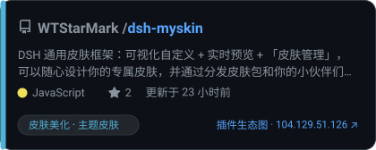

# 插件生态图 · Plugin Ecosystem Map

**把带 `dsh` 系列 GitHub 标签的仓库，画成一张可交互的生态网络图。**

[](http://104.129.51.126/)
[](#测试)
[](#技术选型)
[](#)

👉 **在线地址：<http://104.129.51.126/>**

<picture>
  <source media="(prefers-color-scheme: dark)" srcset="http://104.129.51.126/preview.svg?theme=dark">
  <source media="(prefers-color-scheme: light)" srcset="http://104.129.51.126/preview.svg?theme=light">
  
</picture>

> 预览图由站点实时渲染（`/preview.svg?theme=dark|light`），读 `data/mesh-core.json`，随采集更新。
> 静态副本：[`docs/preview.svg`](docs/preview.svg) · [`docs/preview-light.svg`](docs/preview-light.svg)（`node tools/snapshot-svg.mjs --theme dark`）。

---

## 这是什么

自动捕获带以下标签的 GitHub 仓库：

`dsh` · `dsh-desktop` · `dsh-plugin` · `dsh-plugin-desktop` · `dsh-plugin-market` · `dsh-plugins`

然后**按功能**（不是按标签）把它们铺成一张生态图：

- **圆心**固定为官方仓库 `deepseek-ai/deepseek-harness`
- **21 个功能扇区**：智能体技能、模型接入、桌面客户端、界面面板、皮肤美化、插件市场、会话交互、记忆上下文、语音提醒、工具命令、开发调试、Web 前端、用量额度、安全权限、远程访问、集成桥接、文件管理、阅读文档、桌宠娱乐、**协议基座**、其他
- **细枝分类**：每个扇区下再分 3~8 个细枝（共 79 条规则），单扇区放大时铺成二级扇区
- **单扇区放大**：点任一扇区，该扇区铺满整圆，圆内按细枝重新分扇区

> 这不是 DSH 插件，不依赖 DSH 运行时；它是一个独立的静态前端 + Python 采集后端。

## 功能

| 能力 | 说明 |
|---|---|
| 扇区布局 | 按功能分区、同心散布；位置由可播种 PRNG 决定，**同一 seed 逐点可复现** |
| 单扇区放大 | 点扇区 → 大扇区当整圆、细枝当扇区；`Esc` 或「← 返回全局」退回 |
| 侧栏顺序 | 左栏：总览 → 功能扇区 → 筛选 → 划分依据 → 捕获标签 → 高频标签。右栏未选中：图例 → 操作提示 → 待复核清单；选中后：仓库档案 → 命中标签 → 仓库主题 → 关联 → 图例 → 操作提示 |
| 状态圆环 | 顶栏圆环 = 下一次扫描的倒计时（读 `/api/status` 的 `nextRunAt`，本地每秒走格；正在采集时环会转）。点开浮窗看后端进度：阶段、分段、请求与配额、README 索引、上一轮耗时；拿不到状态就显示"无采集器状态" |
| 三类连线 | 点选仓库就画出它的**同作者**（完整关系：不论几个同作者仓库都能互相指向）、**主题共现**（琥珀虚线）与**生态共鸣**（紫罗兰实线）；度数上限只裁主题边，owner 边豁免 |
| 目标光圈 | 被连线指着的球按边色套光圈（主色 / 琥珀 / 紫罗兰）；同一球被两类线指着时外扩 2.4px 一档。连线两端退让到光圈外沿（`trimSegment`） |
| 搜索指向 | 搜索后从圆心射出一道光（三层叠加，宽度随缩放自适应）指向每个命中；清空即消失。命中**超过 100 个只高亮、不画线**，状态栏注明原因 |
| 搜索范围 | 本地即时匹配仓库名 / 作者 / 描述 / topics；README 内容走 `GET /api/search`（防抖 260ms），服务端只回命中 id。接口不可用时只用本地匹配 |
| README 索引 | 采集器每轮补抓一批（默认 `--readme-budget 150`）：先补未抓过的（星标高优先），再刷 45 天前的；抓不到的记空串，不再重试 |
| 索引体积 | 只存检索摘要（去徽章/图片/链接 URL/HTML/markdown 记号，截断 2000 字符）+ gzip，约 1.1KB/篇：1.9 万仓库约 20MB，默认跳过 0 星后约 **10MB**（`/api/health` 的 `readme` 字段可见）。旋钮：`--readme-max-chars`、`--readme-min-stars`（默认 1）、`--readme-budget 0`（关闭） |
| 相关性判定 | 三档结论：**确认相关**（有 DSH 专有线索）/ **确认噪声**（与 DSH 无关、空壳、堆标签，可一键隐藏）/ **仍需人工**；只有真正模糊的才进「待复核」 |
| 噪声黑名单 | 两条判据任一命中即判垃圾账号：**① 收录超过 300 个仓库、且 0 星占比超过 98%**（批量刷标签号）；② 收录超过 200 个仓库、且全部 0 星。命中后从扫描管道与累积索引剔除，前端与预计算产物也不再展示；判定理由（仓库数 / 0 星占比 / 判据）记进 `meta.noiseBlacklist` |
| 筛选 | 标签「与」语义、语言、归档状态、关键词搜索；筛选只淡化不移除，位置保持不变 |
| 头像 | 并发 6、按 URL 去重、球太小不发请求；默认开 |
| 手机端 | ≤900px 画布全屏、侧栏变底部抽屉且**左右互斥**、双指缩放、安全区适配 |
| 访问统计 | 同端口最小 API：访问数 / 同时在线；拿不到接口时整栏隐藏 |
| 缓存 | gzip + ETag/304 + IndexedDB 秒开 + 后台校验 |
| 双主题 | 清爽（蓝白）、粉黛；明暗各一套，画布文字深色白字 / 浅色黑字 |

## 快速开始

**看线上版**：<http://104.129.51.126/>

**本地跑**（零依赖，只要 Node ≥ 20）：

```bash
git clone <repo> && cd dsh-plugin-mesh
npm run serve:lan                        # http://<你的局域网IP>:8788/
npm test                                 # 163 项前端测试
python3 backend/tests/test_collector.py  # 64 项后端测试
```

**采集数据**（需要 GitHub 令牌，见下）：

```bash
cp .env.example .env     # 填入 GITHUB_TOKEN=...
python3 backend/collect.py --once                  # 跑一轮
python3 backend/collect.py --loop --interval 3600  # 常驻，每小时一轮
python3 backend/collect.py --from-store            # 改了规则后离线重算前端契约（不联网、不吃配额）
```

> ⚠️ 用 pm2 托管时必须写 `--loop` 而不是 `--watch`：pm2 会把 `--watch` 认成它自己的文件监听开关，
> 于是采集器每次落盘都被 SIGINT 重启（实测重启 347 次、丢掉 1.5 万个仓库）。

## 需要什么样的 GitHub 令牌

采集器只读**公开仓库**的搜索接口，令牌不需要任何仓库权限，唯一作用是提高配额：

| 项 | 要求 |
|---|---|
| 类型 | **Fine-grained personal access token**（推荐）或 classic token |
| 权限 / scopes | **全都不勾**（公开搜索不需要权限） |
| 仓库访问 | `Public repositories` 即可（fine-grained 下选 "Public Repositories (read-only)"） |
| 有效期 | 建议 90 天，到期换新 |
| 效果 | 搜索接口 **30 次/分**（匿名只有 10 次/分），core 5000 次/时 |

**获取步骤**：GitHub → Settings → Developer settings → Personal access tokens → Fine-grained tokens → Generate new token →
Repository access 选 *Public repositories* → Permissions 全部留空 → 生成后复制 `github_pat_...`。

**放到哪里**：项目根目录的 `.env`（已在 `.gitignore` 里，服务端 403 不可读）：

```
GITHUB_TOKEN=github_pat_xxxxxxxx
```

配置好后用自检脚本确认（**只打印配额数字，不打印令牌**）：

```bash
python3 backend/check_token.py
# 期望：search 上限 30 / 判定: 令牌生效（30 次/分档）
```

## 数据管线

Python 标准库实现，零 pip 依赖、零模型调用：

```
GitHub 搜索 API
   └─ 分段扫描（segments.py）
        ├─ 抓取空间切成「标签 × 星标区间」的段
        ├─ 一段命中数 > 1000（接口上限）就按创建时间细分：年 → 季度 → 月 → 半月 → 日
        ├─ 每轮只刷新最久没动的一批（默认预算 120 次请求），先检索新仓库、后更新旧仓库
        ├─ 黑名单作者的仓库直接跳过（不消耗配额、不进索引）
        └─ 结果并入【累积索引】data/cache/repos.json，跨轮次累加，最终覆盖全部仓库
   └─ 构建（build.py）
        ├─ 噪声黑名单判定：作者收录 > 200 个仓库且每个仓库星标 < 1 => 剔除并长期拉黑
        ├─ 功能分类（classify.py，与前端规则逐条对齐）
        ├─ 同作者 / 主题 连线
        └─ 产出 data/mesh.json（前端契约）+ data/snapshots/<时间戳>.json + data/last-crawl.json
```

**几条硬规矩**：

- **缩水保护**：某轮构建出的索引不足现有规模的 80% 时，拒绝覆盖前端数据与快照
- **截断记账**：连一天都超过 1000 条的段，如实记进 `segments.json` 的 truncated 列表，不假装全量
- **无变化不写快照**：索引与上一份完全一致时跳过写盘
- **只留 2 份快照**：`KEEP_SNAPSHOTS = 2`
- **落盘顺序**：先写仓库数据、后写队列状态，且都用临时文件 + 原子替换（否则进程被杀会让队列「记着抓完了、数据却没了」）
- **噪声黑名单长期生效**：判定结果写进 `data/noise-blacklist.json`，之后每轮直接跳过（人工删掉条目即可解除）；
  阈值在 `backend/dsh_mesh/config.py` 的 `NOISE_OWNER_MIN_REPOS` / `NOISE_OWNER_MAX_STARS`，前端 `src/mesh-data.js` 里有一份同样的兜底判定

## 分类算法

规则表在 `tools/categories.mjs` 与 `backend/dsh_mesh/classify.py`，**两份逐条一致**，由 `backend/verify_parity.py` 校验（节点集合、功能分类、连线集合逐项比对）。

| 机制 | 说明 |
|---|---|
| 信号 | 仓库名（权重 ×2）+ 描述 + 非白名单 topic；**白名单标签本身不作为分类证据**，否则就退化成「按标签分组」 |
| 词边界 | 英文词按词边界匹配（允许简单复数），中文按子串。修掉裸子串误命中：`ui`←build、`cli`←client、`hub`←github、`store`←restore、`rag`←storage、`api`←rapid |
| 门槛 gate | **插件市场**必须「名字本身就是汇总」（末段/首段是 market/store/registry/合集/导航…）或描述明确自述「收录/汇集」；给市场加按钮的插件不算 |
| 排除 exclude | **桌面客户端**排除客户端插件：名字带 plugin/插件/extension/skill/theme 的一律不算；描述里「本仓库是一个客户端」这类自述可救回 |
| 细枝 | 每个扇区内再按同一套规则挑 3~8 个细枝（共 79 条），用于单扇区放大 |
| 生态语境 | **协议基座**＝生态规范 / 互操作协议 / 接口契约，以及侧边栏底座、皮肤框架这类基座。先过生态语境门槛，再让"基座自述"强命中直接胜出，避免「最大公约数」「标准差」误抓；样本再少也不并进「其他」（keepIds） |
| 改名别名表 | `data/cache/aliases.json`（旧名 → 现名）在加载与合并时归一，避免搜索索引延迟把旧名带回来；`build.py` 离线构建同样处理。迁移工具在采集器运行时拒绝执行 |
| 改名去重 | 采集记录保留 `githubId`（改名不变），累积索引按它认人：改名即就地挪键并记 `renamedFrom`；构图再按 `githubId` 兜底去重。存量数据用 `tools/dedupe-renames.mjs` 迁移 |
| 非插件排除 | 挂 dsh 标签但 DSH 是别的意思（如 DeepHash-pytorch 的 DSH = Deep Supervised Hashing）的仓库不进索引：判据是 tools/categories.mjs 与 classify.py 里的 NOT_PLUGIN_PATTERNS，两条管线逐条一致 |
| 生态共鸣 | 人工策展的「基座 → 长在它上面的插件」（紫罗兰实线）：归属信号用生态签或名字自述，再逐仓抓 README 复核依赖/扩展/遵循语境。清单 `tools/ecosystem.json`，策展工具可复跑 |
| 策展基座 | 清单里的基座直接归入协议基座（`categoryCurated`），正文不一定写"基座"二字 |
| 共鸣开关 | 每个基座带 `enabled` 字段：置 false 只停【共鸣边】，基座身份与协议基座归类不受影响（皮肤框架当前临时关闭，改回 true 即恢复） |
| 三档判定 | 相关性不再只有一个 review 布尔：analyze_relevance 给出 related / noise / manual + 一句话原因（JS 在 tools/relevance.mjs，Python 在 build.py，两份逐条一致） |
| re.ASCII | Python 的 `\b` 默认是 Unicode 语义（中文算 word char），必须加 `re.ASCII` 才与 JS 一致 |

**精度效果**（本地 2625 个仓库就地重分类，节点数不变）：

| 指标 | 改进前 | 改进后（v0.4.3 数据） |
|---|---|---|
| 未分类（其他） | 526 | **317** |
| 归类率 | 79.96% | **87.9%** |
| 扇区 | 19（18 类 + 其他） | **21**（20 类 + 其他，新增「协议基座」） |
| 有扇区但没细枝 | 255 | **178**（新细枝：检索搜索、版本控制、媒体处理、进程运行时、编码代理、多代理协作、运行时预设、推理思考、参数预设、多模型协同、移动端界面、终端界面、创作工作台、审计扫描、防护拦截、互操作协议…） |
| 待复核队列 | 321（旧口径：相关度 ≤ 2 一律待复核） | **95**（另 93 判为确认噪声、2437 判为确认相关） |
| 桌面客户端扇区 | 278 | **187**（清掉的全是客户端插件） |
| 插件市场扇区 | 99 | **62**（清掉的全是「提到市场」的插件） |

## 安全

本项目只监听一个端口（线上是 **80**），预览服务按最小暴露面加固：

- **路径白名单**：只提供 `/`、`/index.html`、`/styles.css`、`/src/*.js`、`/data/mesh.json`；`backend/`、`tests/`、`docs/`、`data/cache/`、`.env` 一律 403
- **方法白名单**：只允许 `GET` / `HEAD`，接口只认 `GET /api/stats` 与 `POST /api/ping`
- **Host 白名单**：只接受本机地址，挡掉 DNS rebinding 型伪造 Host
- **安全响应头**：CSP（script/style/connect 均为 self，图片仅放行 GitHub 头像域）、`nosniff`、`no-referrer`、`CORP: same-origin`、`frame-ancestors 'none'`
- **统计接口防滥用**：id 正则校验、请求体上限 1KB、每 IP 每分钟 60 次限流
- `tests/serve.test.mjs` 会真的把服务起起来逐条验证上述每一条

## 测试

```bash
npm test                                  # 163 项：布局 / 连线 / 分类（协议基座·桌宠·非插件排除）/ 细枝 / 相关性判定 / 生态共鸣 / 面板 / 主题 / 噪声黑名单 / 服务加固 / 冒烟
python3 backend/tests/test_collector.py   # 64 项：分类 / 分段扫描 / 快照 / 调度 / 采集顺序 / 噪声黑名单 / 三档判定 / 预计算容错
python3 backend/verify_parity.py          # 跨语言一致性（JS 管线 vs Python 采集器）
```

## 部署（pm2 + 端口 80）

```bash
cd /opt/dsh-plugin-mesh
export PATH=/opt/dsh-runtime/node/bin:$PATH
HOST=0.0.0.0 PORT=80 pm2 start tools/serve.mjs --name dsh-plugin-mesh
pm2 start backend/collect.py --name dsh-mesh-collector --interpreter python3 -- --loop --interval 3600 --budget 600
pm2 save && pm2 startup systemd
```

## 目录结构

```
index.html  styles.css            前端外壳与样式
src/
  app.js            应用装配：状态、筛选、动作、主题
  graph.js          Canvas 2D 渲染（扇区光锥 / 节点 / 连线 / 头像 / 标签）
  layout-sector.js  扇区散布布局（可播种、可复现）
  panels.js         左栏 / 右栏 / 悬浮提示
  mesh-data.js      数据层 + 预览图配色
  palettes.js       清爽 / 粉黛 × 明暗，共 4 套主题
  links.js  rng.js  avatars.js  cache.js  stats.js
tools/
  serve.mjs         加固版静态服务（白名单 + 统计 API）
  categories.mjs    分类规则表（与 Python 逐条对齐）
  reclassify.mjs    就地重分类（不重新采集）
  snapshot-svg.mjs  README 预览图离线副本（--png 可生成核对图）
  preview-svg.mjs   预览渲染核心：站点 /preview.svg 与离线副本共用
  seed-sample.mjs  preview-ascii.mjs
backend/
  collect.py        采集入口（--once / --loop / --budget / --from-store / --from-raw）
  dsh_mesh/         github / segments / classify / build / snapshot / config
  verify_parity.py  跨语言一致性校验
  check_token.py    令牌自检（只打印配额数字）
  tests/            64 项测试（前端 163 项在根目录 tests/）
docs/               data-contract.md 与预览图
```

## 技术选型

- **前端零依赖、无构建**：ES 模块 + Canvas 2D，`node:test` 单测；不引框架、不引 three.js
- **后端零 pip**：只用 Python 标准库（urllib / json / unittest），`python3 backend/collect.py` 直接跑
- **不用模型分类**：500+ 仓库逐个让模型读就是烧 token，且结果不稳定、无法 diff；规则表可审计、可复跑、可手改

## 使用：查询 API（与前端同端口）

线上 demo：`http://104.129.51.126` · 本地开发：`http://127.0.0.1:8788`

> **版本要求**：API 与卡片是 **v0.4.1** 起提供的功能。上面的线上地址要等部署 v0.4.1 之后才生效；
> 想在部署前先试，把 `BASE` 换成本机预览地址（如 `http://127.0.0.1:8788`）即可，命令一字不用改。

API 与前端**共用同一个端口**：不需要另外开服务、不需要任何密钥、不占用额外端口。
零依赖（Python 标准库 + Node 标准库）、**只读**、允许跨域（`Access-Control-Allow-Origin: *`），
响应带 5 分钟公共缓存，数据每小时更新一次。

### 端点一览

| 方法 | 路径 | 说明 |
|---|---|---|
| GET | `/api` | 端点清单（自描述，建议先看这个） |
| GET | `/api/health` | 健康检查 + 数据概况（节点数、生成时间） |
| GET | `/api/categories` | 扇区（功能分类）与细枝，含各自数量 |
| GET | `/api/repos` | 检索仓库（过滤 / 排序 / 翻页），`q` 同时匹配 **README 正文** |
| GET | `/api/search?q=&limit=` | 紧凑检索：只回命中 id 与计数（含 README 命中），供前端搜索框高亮用 |
| GET | `/api/status` | 采集进度状态：`nextRunAt`（下一轮开始）、阶段、分段与 README 进度、请求与配额；不缓存 |
| GET | `/api/repos/:owner/:name` | 单个仓库详情 + 同作者 / 主题共现连线 |
| GET | `/api/card/:owner/:name.svg` | 可分享的 SVG 卡片（见下一节） |
| GET | `/preview.svg`（同 `/api/preview.svg`） | README 预览图：按当前数据实时渲染的生态图（`?theme=dark|light&size=&sample=`），ETag + 5 分钟缓存 |
| GET | `/card/:owner/:name` | 卡片分享页（预览 + 嵌入代码） |
| GET | `/api/stats` | 访问统计（只读） |
| POST | `/api/ping` | 上报一次访问（前端自动调用，唯一接受 POST 的接口） |

### 30 秒上手

```bash
BASE=http://104.129.51.126

# 1. 星标最高的 5 个仓库
curl -s "$BASE/api/repos?sort=stars&limit=5"

# 2. 搜关键词（匹配 owner/name、描述、topics、命中标签）
curl -s "$BASE/api/repos?q=皮肤&limit=3&fields=all"

# 检索（含 README 正文）：只要命中 id 与计数，体积很小
curl -s "$BASE/api/search?q=sidebar&limit=500"

# 3. 某个扇区下的仓库（扇区 id 从 /api/categories 拿）
curl -s "$BASE/api/repos?category=skin&sort=stars&limit=10"

# 4. 单个仓库的完整档案（含关系连线）
curl -s "$BASE/api/repos/WTStarMark/dsh-myskin"

# 5. 生态总览：扇区 + 细枝分布
curl -s "$BASE/api/categories"
```

### 检索参数（`/api/repos`）

| 参数 | 默认 | 说明 |
|---|---|---|
| `q` | — | 关键词，匹配 `owner/name`、描述、topics、命中标签（不区分大小写） |
| `category` | — | 扇区 id，如 `agent` / `skin` / `desktop` |
| `subcategory` | — | 细枝 id，如 `skin-theme` |
| `tag` | — | 采集标签：`dsh` / `dsh-plugin` / `dsh-desktop` / `dsh-plugin-desktop` / `dsh-plugin-market` / `dsh-plugins` |
| `language` | — | 主语言，如 `TypeScript` |
| `minStars` | `0` | 最低星标数 |
| `archived` | — | `hide` = 隐藏归档；`only` = 只看归档 |
| `sort` | `stars` | `stars` 星标 / `pushed` 最近推送 / `created` 创建时间 / `name` 名称 |
| `limit` | `20` | 每页条数，**上限 100**（超出自动夹到 100） |
| `offset` | `0` | 偏移量，用于翻页 |
| `fields` | 精简 | 传 `all` 返回完整字段（描述、topics、许可证、主页、创建/推送时间、归档与复核标记） |

### 响应示例

```json
{
  "query": { "q": "harness", "sort": "stars", "limit": 2, "offset": 0 },
  "total": 1981,
  "count": 2,
  "offset": 0,
  "limit": 2,
  "generatedAt": "2026-10-01T17:00:42Z",
  "items": [
    {
      "id": "deepseek-ai/deepseek-harness",
      "stars": 241610,
      "categoryLabel": "智能体技能",
      "subcategoryLabel": null,
      "language": "TypeScript",
      "description": "…"
    }
  ]
}
```

### 约定与错误码

- **只读**：非 `GET`/`HEAD` 一律 `405`（仅 `/api/ping` 接受 `POST`）；`OPTIONS` 返回 `204`，方便浏览器预检。
- **缓存**：`Cache-Control: public, max-age=300`。数据每小时更新，查询结果与卡片都会跟着变。
- **跨域**：允许任意来源引用——这是公开的只读数据，适合直接在前端页面里 fetch。
- **限流**：沿用服务端按 IP 的滑动窗口限流，超限返回 `429`。
- **校验**：仓库名按 GitHub 字符集做白名单校验，非法返回 `400`；未收录返回 `404`（卡片请求的 404 会回一张占位图，不会出现裂图）。

| 状态码 | 含义 |
|---|---|
| 200 | 正常 |
| 204 | 预检通过（OPTIONS） |
| 400 | 仓库名不合法 |
| 404 | 未收录该仓库 |
| 405 | 使用了写方法 |
| 429 | 请求过于频繁 |

## 使用：卡片（给别人的项目用）

任何被收录的仓库都有一张**自包含 SVG 卡片**：无脚本、无外部字体、无外部依赖，**420×168，GitHub 仓库卡片风格**（默认深色，`?theme=light` 出浅色）。
卡片显示：仓库图标 + `owner / name`、两行简介、● 语言色点（GitHub 语言配色）、★ 星标、⑂ 复刻（为 0 时隐藏）、更新于 X 前，
底部是所属扇区标签（同色淡底）与去处。**点击卡片背景 → 站点；点击仓库名 → GitHub 原仓库**（两个链接是兄弟节点，不是嵌套）。

**卡片长这样（点图直达线上生态图）：**

[](http://104.129.51.126/)

[](http://104.129.51.126/)

> 上面两张是仓库内的静态样本（`docs/card-example*.svg`），按当前数据生成、随仓库一起版本化；
> 每张卡片都包在链接里，点图即可前往线上站点。真实卡片（数据每小时更新）：
> http://104.129.51.126/api/card/WTStarMark/dsh-myskin.svg

### 贴进 README

```markdown
[](http://104.129.51.126/)
```

### 贴进网页

```html
<!-- 最省事：img（注意：用 img 嵌入时 SVG 内部的链接不生效，所以去处也印在了卡面上） -->
<a href="http://104.129.51.126/">
  
</a>

<!-- 想要卡片本身可点：object -->
<object type="image/svg+xml" data="http://104.129.51.126/api/card/WTStarMark/dsh-myskin.svg" width="420" height="168"></object>
```

### 卡片参数

| 参数 | 默认 | 说明 |
|---|---|---|
| `theme` | `dark` | 默认 GitHub 深色；传 `light` 出浅色版（SVG 读不到系统的 prefers-color-scheme，需要显式指定） |
| `link` | `http://104.129.51.126/` | 点击去处。只接受 `http`/`https`（`javascript:` 之类自动回落默认），**保留完整路径**，可指向仓库页或文档页 |

```bash
# 浅色版 + 导向本仓库的 GitHub 页面
http://104.129.51.126/api/card/WTStarMark/dsh-myskin.svg?theme=light&link=https://github.com/WTStarMark/dsh-myskin
```

### 交互式获取代码

打开 `http://104.129.51.126/card/<owner>/<name>`：深色/浅色两版实时预览，Markdown 与 HTML 代码一键复制（默认深色）。

例：http://104.129.51.126/card/WTStarMark/dsh-myskin

### 换掉默认去处

部署时用环境变量统一改（无需改代码）：

```bash
SITE_URL=https://your-site.example pm2 restart dsh-plugin-mesh --update-env
```

> 本机开发预览：`http://192.168.22.250:8788/api/card/WTStarMark/dsh-myskin.svg`（卡片与前端同端口）

## 许可

数据来自 GitHub 公开搜索接口，版权归各仓库作者所有。
